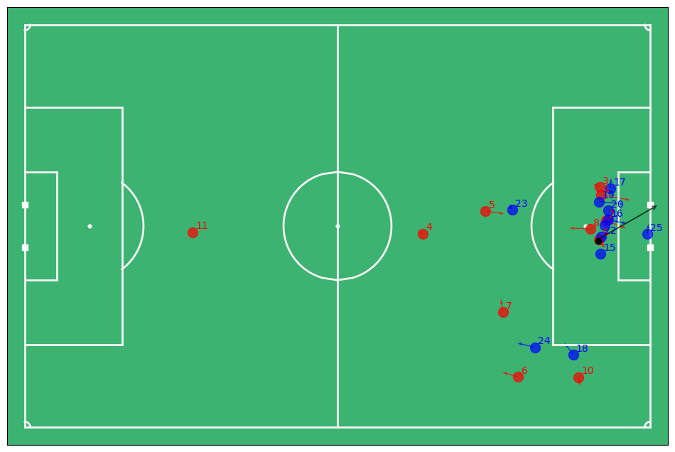
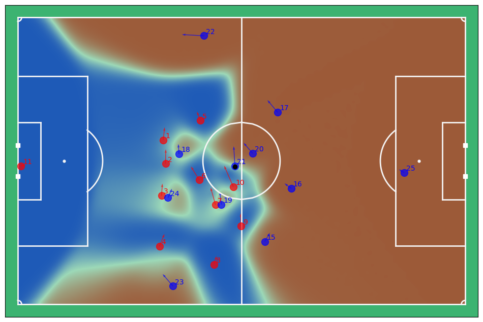

# Football Match Analysis

A Python library that utilizes object-oriented design principles to simplify the analysis and exploration of footballing event & tracking data. This library is built upon Friend's of Tracking's [Metrica Tracking Data Library](https://github.com/Friends-of-Tracking-Data-FoTD/LaurieOnTracking) and from their work generates easy-to-use wrapper objects such as Match, Moment, Player, Ball and Plot, which makes the extraction, analysis and visualization of key match moments as simple as a few lines of Python.

### Table of Contents
<!--TOC-->

- [Football Match Analysis](#footbal-match-analysis)
  - [Features](#features)
  - [Getting Started](#getting-started)
  - [Data Sources](#data-sources)
  - [Tutorials](#tutorials)
  - [Examples](#examples)
  - [Resources](#resources)
  - [Licenses](#licenses)


## Features
- ⚽ Reduces friction when working with event & tracking data
- 📊 Aggregate match events for player and oppositional analysis
- 🗺️ Generate plots to visualizaize key moments in a match
- 🔎 Identify how player movement impacted key moments in a match
- 🤼 Explore pitch control for any moment in a match
- 🥅 Implementation of simplified xG and xT model
- 🏃 Calculate physical statistics for all players on the pitch

## Getting Started

1. Clone the repository

   ```shell
   git clone https://github.com/JohnComonitski/FootballMatchAnalysis.git
   ```

2. Create a data directory

   ```shell
   mkdir data
   ```
  > [!NOTE]
  > This is where you will be storing your tracking data and event data.

3. Download an EPV Grid
   Download Friends of Tracking's [EPV_grid.csv](https://github.com/Friends-of-Tracking-Data-FoTD/LaurieOnTracking/blob/master/EPV_grid.csv) and copy it to your data directory
    ```shell
   cp EPV_grid.csv ./data/EPV_grid.csv
   ```
  > [!NOTE]
  > This will only be needed if you intend to do Expected Point Value analysis.

4. Create and activate a Python
   [virtual environment](https://docs.python.org/3/library/venv.html#creating-virtual-environments).
   On GNU/Linux systems this is as easy as:

   ```shell
   python3 -m venv .venv
   . .venv/bin/activate
   # Work inside the environment.
   ```

5. Install the Python dependencies

   ```shell
   pip install -r requirements.txt
   ```

6. In your Python script, import the Match object

    ```python
    from events.match import Match
    ```

## Data Sources
 - [Official Metrica Tracking & Event Data](https://github.com/metrica-sports/sample-data)
 - [Generate Your Own Tracking & Event Data](https://github.com/JohnComonitski/FootballTrackingDataGeneration)
  > [!NOTE]
  > Data should be added to the ./data directory and each match should be contained to its own directory in the following format.
  > ```
  > 📁 data
  >    📁 MATCH_ID
  >      📄 MATCH_ID_RawEventsData.csv
  >      📄 MATCH_ID_RawTrackingData_Away_Team.csv
  >      📄 MATCH_ID_RawTrackingData_Home_Team.csv
  > ```

## Tutorials
To hit the ground running with the FMA Library, I've created a series of [Jupyter Notebooks](https://github.com/JohnComonitski/FMATutorials) that can be worked through to better understand the fundementals of working with the Pandas Dataframes, Event Data, Tracking Data and other advance match analysis topics.

## Objects
The FMA Library employs an object-oriented design to simplify match analysis. These are the objects you'll be working with...
- 🥅 **Match:** The Match object holds the event & tracking data and includes a number of functions to make accessing events, players and the ball for any given moment simple.
- ⏱️ **Moment:** A Moment represents a given frame during the match and will include helper methods to assist in analyzing moments in a match, as well as quick access to every player and the ball's location and velocity during that given frame.
- 🏃 **Player:** A Player object represents a player during a given moment in time.
- ⚽ **Ball:** A Ball object represents a player during a given moment in time.
- 🎨 **Plot:** A Plot is simply a Matplotlib plot of a football pitch, which can be annotated or passed to other objects to visualize key moments during a match.

## Examples
### Get All Events Types That Happen in a Match
Get a list of every type of event that occoured in the match.

```python
from events.match import Match

# Load Event Data
DATADIR = './data'
game_id = 2

match = Match(DATADIR, game_id)
match.event_types()
```

### Get All Instances of a Given an Event Type
Get a list of moments when a specific event occurred in the match.

```python
from events.match import Match

# Load Event Data
DATADIR = './data'
game_id = 2

match = Match(DATADIR, game_id)
match.get_events("PASS")
```

### Plot the Events and Locations of Players the Moment Before a Goal
Plot the location of every player on the field the moment before the first goal..

```python
from analysis.player import *
from events.match import Match

# Load Event Data
DATADIR = './data'
game_id = 2

match = Match(DATADIR, game_id)
goals = match.goals()
goal_frame = goals.iloc[0]["Start Frame"]

moment = match.get_moment(goal_frame)
moment.plot_moment()
```



### Plot Pitch Control For a Given Moment in a Match
Plot the location of every player on the field during a given moment of a match and describe who controls what sections of the pitch using a Voronoi diagram.

```python
from analysis.event import *
from events.match import Match

# Load Event Data
DATADIR = './data'
game_id = 2

match = Match(DATADIR, game_id)
frame = 100

moment = match.get_moment(frame)
moment.plot_pitch_control()
``` 



## Resources
 - [Football Match Analysis Library Tutorials](https://github.com/Friends-of-Tracking-Data-FoTD/LaurieOnTracking) - Jupyter Notebooks to help better understand the fundementals of working with the Pandas Dataframes, Event Data, Tracking Data and other advance match analysis topics using the FMA Library.
 - [Friends of Tracking](https://www.youtube.com/@friendsoftracking755) - The best resource on the internet for advanced football analysis and data science. This library stands on the shoulders of their great work!
 - [Introduction to Football Analysis with Tracking Data in Python](https://www.youtube.com/watch?v=8TrleFklEsE) - Learn the fundamentals of working with tracking data. Much of what you learn & use in this tutorial is the backbone of this library.
 - [Metrica Analysis Library](https://github.com/Friends-of-Tracking-Data-FoTD/LaurieOnTracking) - Python library for easily working with Metrica tracking & event data. This library would not be possilbe without this library.


## Licenses
MIT License
Copyright (c) 2025 John Comonitski
