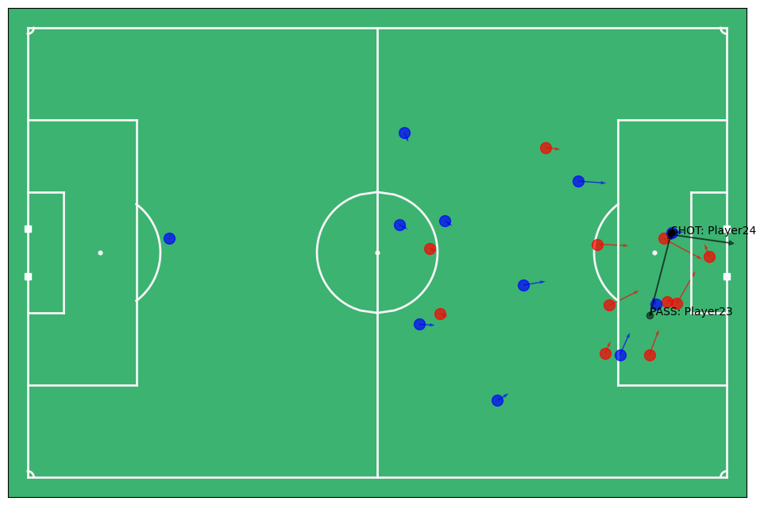
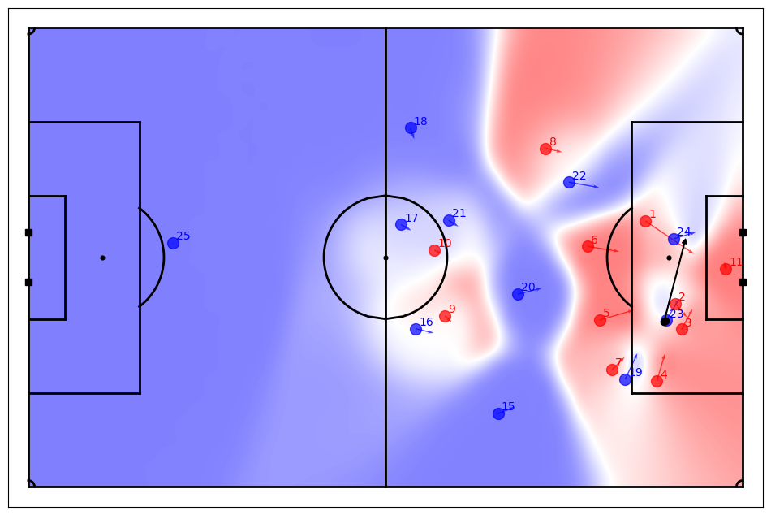

# Football Match Analysis

A Python library that builds apon Friend's of Tracking's [Metrica Tracking Data Library](https://github.com/Friends-of-Tracking-Data-FoTD/LaurieOnTracking) and creates easy to use wrapper functions for many of the match analysis examples in Friend's of Tracking's [Tracking Data Tutorial Series](https://www.youtube.com/watch?v=8TrleFklEsE). Additionally, this library includes a new Match object which makes the extraction & analysis of key match moments as simple as a few lines of python.

<!--TOC-->

- [Football Match Analysis](#footbal-match-analysis)
  - [Getting Started](#getting-started)
  - [Features](#features)
  - [Getting Tracking Data](#getting-tracking-data)
  - [Examples](#examples)
  - [Data Sources](#data-sources)
  - [Resources](#resources)
  - [Licenses](#license)


## Getting Started

1. Clone the repository

   ```shell
   git clone https://github.com/JohnComonitski/FootballMatchAnalysis.git
   ```

2. Move to the project directory

   ```shell
   cd FootballMatchAnalysis
   ```

3. Create a data directory

   ```shell
   mkdir data
   ```
  > [!NOTE]
  > This is where you will be storing your tracking data and event data.

4. Download an EPV Grid
   Download Friends of Tracking's [EPV_grid.csv](https://github.com/Friends-of-Tracking-Data-FoTD/LaurieOnTracking/blob/master/EPV_grid.csv) and copy it to your data directory
    ```shell
   cp EPV_grid.csv ./data/EPV_grid.csv
   ```
  > [!NOTE]
  > This will only be needed if you inted to do expected point value analysis.

5. Create and activate a Python
   [virtual environment](https://docs.python.org/3/library/venv.html#creating-virtual-environments).
   On GNU/Linux systems this is as easy as:

   ```shell
   python3 -m venv .venv
   . .venv/bin/activate
   # Work inside the environment.
   ```

6. Install the Python dependencies

   ```shell
   pip install -r requirements.txt
   ```

7. In your python script, import the supporting libraries

    ```python
    from analysis.event import *
    from analysis.player import *
    from events.match import Match
    ```

## Features
- ⚽ Reduces friction when working on match analysis
- 📊 Aggregate match events for player and opposition analysis
- 🗺️ Plot every event in a match
- 🔑 Quickly visualize key moments in a match
- 🔎 Identify how player movement impacted key moments in a match
- 🏃 Calculate the physical statistics for all players on the pitch


## Examples
### Get All Events Types That Happen in a Match
Get a list of every type of event that occoured in the match.

```python
from events.match import Match

# Load Event Data
DATADIR = './data'
game_id = 2

match = Match(DATADIR, game_id)
match.event_types()
```

### Get All Moments an Event Occoured
Get a list of moments that a specifc event occoured in the match.

```python
from events.match import Match

# Load Event Data
DATADIR = './data'
game_id = 2

match = Match(DATADIR, game_id)
match.get_events("PASS")
```

### Plot the Events and Locations of Players Moments Before a Goal
Plot the location of every player on the field the moment before the first goal and plot the passes that led up to the goal.

```python
from analysis.player import *
from events.match import Match

# Load Event Data
DATADIR = './data'
game_id = 2

match = Match(DATADIR, game_id)
goals = match.goals()
goal_frame = goals.iloc[1].name

plot_goal(match, goal_frame)
```



### Plot Pitch Control For a Given Moment in a Match
Plot the location of every player on the field during a given moment of a match and describe who controls what sections of the pitch using a voronoi diagram.

```python
from analysis.event import *
from events.match import Match

# Load Event Data
DATADIR = './data'
game_id = 2

match = Match(DATADIR, game_id)
frame = 100

plot_pitch_control(match, frame)
``` 



### Calculate Distance Traveled by Each Player
Calculate the distance traveled in kilometers by every player in the match.

```python
from analysis.player import *
from events.match import Match

# Load Event Data
DATADIR = './data'
game_id = 2

match = Match(DATADIR, game_id)
track_distance_covered(match)
```


## Data Sources
 - [Metrica Tracking & Event Data](https://github.com/metrica-sports/sample-data)

## Resources
 - [Friends of Tracking](https://www.youtube.com/@friendsoftracking755) - The best resource on the internet for advance football analysis and data science. This library stands on the shoulders of their great work!
 - [Introduction to Football Analysis with Tracking Data in Python](https://www.youtube.com/watch?v=8TrleFklEsE)
  - Learn the fundementals of working with tracking data. Much of what you learn in this tutorial was baked into this library.
 - [Metrica Analysis Library](https://github.com/Friends-of-Tracking-Data-FoTD/LaurieOnTracking)


## Licenses
MIT License
Copyright (c) 2025 John Comonitski

- Add descriptions to resources
- Create & Write data sources section